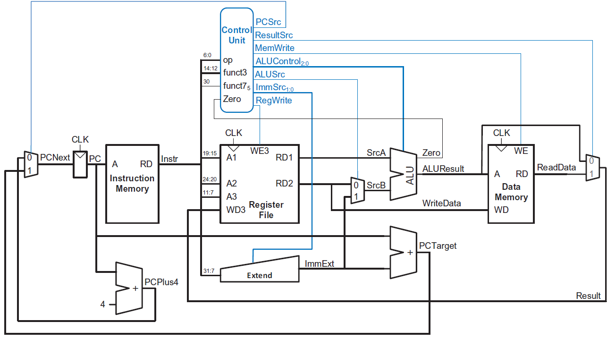
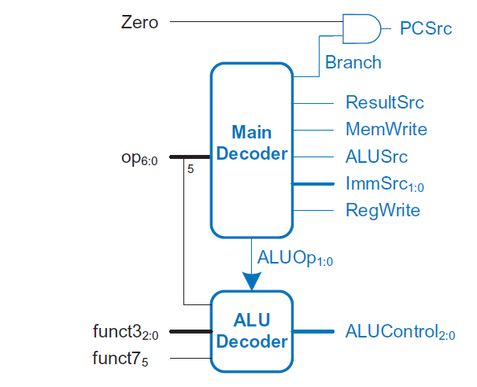
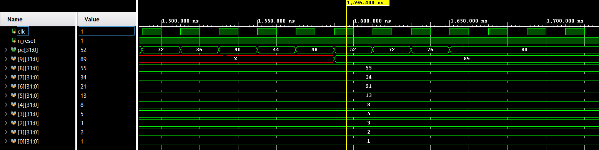
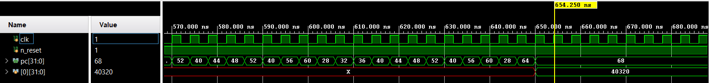
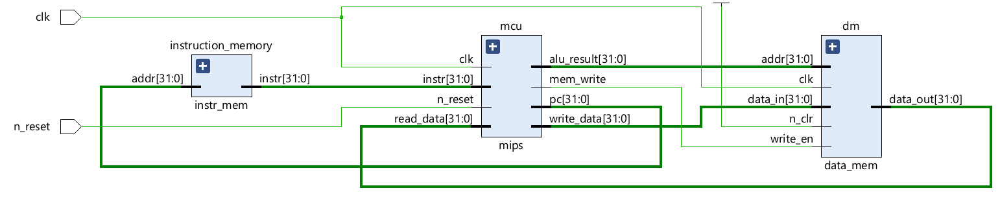

# Single_Cycle_RISC-V_processor


### Table of contents
- [Description](#Description)
- [Architecture](#Architecture)
    - [Data Path](#Data-Path)
    - [Control Unit](#Control-Unit)
    - [Instruction Memroy](#Instruction-Memory)
    - [Data Memory](#Data-Memory)
- [Test Programs](#Test-Programs)
    - [Fibonacci](#Fibonacci)
    - [Factorial](#Factorial)
- [Schematic](#Schematic)
- [Reference](#Reference)

### Description
Implementation of 32-bit Single-Cycle RISC-V processor based on Harvard architecture, It supports 3 different types of instructions which are: <i>***R-Type, I-type, and branch</i> instructions***.

### Architecture

- The architecture  is composed of four main units: 
    *   Data Path.
    *   Control Unit. 
    *   Instruction Memory. 
    *   Data Memory. 
*   The figure below show the RISC-V harvard architecture:



#### Data Path

The Data Path consists of multiple components, each of which is meticulously designed and parameterized for the purpose of reusability.
-   Data Path Units:  
    *   ALU.
    *   Register File.
    *   SignExtend unit.
    *   Adders.
    *   MUXs.

#### Control Unit

<p align="center"></p>

The control unit is composed of two decoders: Main decoder and ALU decoder.
-   The Main decoder utilizes the opcode as its input to output the following control signals:
    *   PCSrc: is a select signal that determines the source of the next PC value.
    *   Branch: it is ANDed with zero flag to determine to perform beq instruction.
    *   ResultSrc: determines which field is written in the Register File.
    *   MemWrite: is an enable signal that allows writing to the Data Memory.
    *   ALUSrc: determines the input source for the ALU.
    *   ImmSrc: specify a 12-, 13-, or 21-bit immediate to extend for various types of instructions
    *   RegWrite: determines which data is passed to the Register File from Data Memory or the ALU result.
    *   ALUOp: is the input signal for the ALU decoder.

-   ALU decoder: receives funct3, funct7 as input, in addition to ALUOp, to determine the operation to be performed by the ALU.
    *    ALUControl: determines the operation of the ALU, whether it is ADD, SUB, MUL, SLT, AND, OR...etc.

#### Instruction Memory

-  The address of the next instruction is given By *Program Counter*.
-  The PC is either incremented by 4 *(32-bit instruction word)* or loaded as a target address from a branch instruction.

#### Data Memory

-   It reads asynchronously while writes synchronously with the rising edge.
-   The input address is calculated via the *ALUResult*, the Data in Register *RD2* is the data to be stored in memory.
-   If WE is set to LOW, the memory is in read mode, it outputs the Data in the given address *A*.

### Test Programs

-   Testing the processor's functionality using two different programs:
    *   Factorial of a number.
    *   Fibonacci Sequence generator.
- Make sure to include the memory files (the ones with machine code) in the same path as the RTL files.

#### Fibonacci

-   Assembly
```Assembly
# This program calculates the fibnacci sequence up to 10 terms.

xor x0,x0,x0
addi x1,x0,0
addi x2,x0,1
addi x3,x0,1
addi x4,x0,1
addi x5,x0,0
addi x6,x0,10
addi x7,x0,0

loop:
beq x3,x4,eq
add x2,x2,x1
sub x3,x3,x4
slli x7,x5,2
sw x2,0(x7)
beq x4,x4,endloop

eq:
add x1,x1,x2
add x3,x3,x4
slli x7,x5,2
sw x1,0(x7)

endloop:
addi x5,x5,1
blt x5,x6,loop
halt
```

-   [Machine Code](https://github.com/0marAmr/Single_Cycle_RISC-V_processor/blob/master/programs/fibonacci/fibonacci.txt)

*   Simulation via vivado:




#### Factorial
-   Assembly
```Assembly
# This program calculates the factorial of number in reg x0.

xor x0, x0, 0
addi x1, x0, 8
addi x2, x0, 1
addi x3, x0, 1
addi x7, x0, 0
addi x8, x0, 1
addi x9, x0, 2

loop1:
blt x1, x9, end
addi x7, x3, 0
addi x2, x1, 0

lable:
blt x2, x9, endloop
add x3, x3, x7
sub x2, x2, x8
beq x9, x9, lablel

endloop:
sub x1, x1, x8
beq x9, x9, loop1
end:
sw x3, 0(x0)
halt
```

-   [Machine Code](https://github.com/0marAmr/Single_Cycle_RISC-V_processor/blob/master/programs/factorial/factorial.txt)

*   Simulation via vivado:




#### Schematic



#### Reference

-   **Digital Designand Computer Architecture RISC-V Edition**
